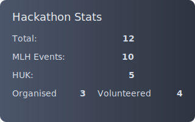

# Hi, I'm Oscar Ryley :)

## Hackathons

    <table style="border-collapse:collapse;border:none;margin:0 auto;">
	    <tr>
		    <td align="center" valign="middle" style="border:none;padding:0 12px 8px 12px;">
                <a href="https://oscar-ryley.github.io/map" target="_blank" rel="noopener noreferrer">
                    <picture>
                        <source media="(prefers-color-scheme: dark)" srcset="https://s.wordpress.com/mshots/v1/https://oscar-ryley.github.io/map?theme=dark&w=960" />
					    
                    </picture>
                </a>
		    </td>
		    <td align="center" valign="middle" style="border:none;padding:0 12px 8px 12px;">
			    
		    </td>
	    </tr>
    </table>

Countries: UK  (England , Scotland ), USA , Canada , Ireland , Slovakia , Spain 

<table style="width:100%;table-layout:fixed;border-collapse:separate;border-spacing:10px 12px;margin-top:8px;">
	<tr>
		<td valign="top" style="width:50%;padding:0;">
			<table width="100%" cellpadding="0" cellspacing="0" style="border:1px solid #30363d;border-radius:8px;background:#0d1117;color:#c9d1d9;table-layout:fixed;">
				<tr>
					<td width="132" valign="top" style="padding:12px 0 12px 12px;">
						
					</td>
					<td valign="top" style="padding:12px 12px 12px 0;word-wrap:break-word;">
						<a href="https://github.com/f2reninj5/peeping_painting" target="_blank" style="text-decoration:none;color:#c9d1d9;display:inline-block;">
							
Peeping Painting

						</a>
						
Hackathon entry

						
The painting that stares back at you: a portrait with face-detection and digital eyes that track viewers.

						

							<a href="https://devpost.com/software/peeping-painting" target="_blank" style="color:#58a6ff;text-decoration:none;display:inline-flex;align-items:center;gap:6px;">
								<svg width="16" height="16" viewBox="0 0 100 100" xmlns="http://www.w3.org/2000/svg" aria-hidden="true"><rect width="100" height="100" fill="none"/><path d="M50 10 Q75 10 85 25 Q95 40 85 55 Q75 65 60 65 L50 65 L50 80 L30 80 L30 20 Q30 10 50 10 M50 30 L50 50 L55 50 Q65 50 70 45 Q75 40 75 30 Q75 20 70 15 Q65 10 55 10 L50 15 L50 30" fill="#0A84FF"/></svg>
								Devpost
							</a>
						

						

							opencv
							opengl
							python
							cython
							raspberry-pi
						

					</td>
				</tr>
			</table>
		</td>
		<td valign="top" style="width:50%;padding:0;">
			<table width="100%" cellpadding="0" cellspacing="0" style="border:1px solid #30363d;border-radius:8px;background:#0d1117;color:#c9d1d9;table-layout:fixed;">
				<tr>
					<td width="132" valign="top" style="padding:12px 0 12px 12px;">
						
					</td>
					<td valign="top" style="padding:12px 12px 12px 0;word-wrap:break-word;">
						<a href="https://github.com/Oscar-Ryley/ExSpore" target="_blank" style="text-decoration:none;color:#c9d1d9;display:inline-block;">
							
ExSpore

						</a>
						
Hackathon entry

						
2D clicker game where you build up a network of diverse mushrooms and grow a community.

						

							<a href="https://devpost.com/software/exspore" target="_blank" style="color:#58a6ff;text-decoration:none;display:inline-flex;align-items:center;gap:6px;">
								<svg width="16" height="16" viewBox="0 0 100 100" xmlns="http://www.w3.org/2000/svg" aria-hidden="true"><rect width="100" height="100" fill="none"/><path d="M50 10 Q75 10 85 25 Q95 40 85 55 Q75 65 60 65 L50 65 L50 80 L30 80 L30 20 Q30 10 50 10 M50 30 L50 50 L55 50 Q65 50 70 45 Q75 40 75 30 Q75 20 70 15 Q65 10 55 10 L50 15 L50 30" fill="#0A84FF"/></svg>
								Devpost
							</a>
						

						

							godot
							gdscript
						

					</td>
				</tr>
			</table>
		</td>
	</tr>
	<tr>
		<td valign="top" style="width:50%;padding:0;">
			<table width="100%" cellpadding="0" cellspacing="0" style="border:1px solid #30363d;border-radius:8px;background:#0d1117;color:#c9d1d9;table-layout:fixed;">
				<tr>
					<td width="132" valign="top" style="padding:12px 0 12px 12px;">
						
					</td>
					<td valign="top" style="padding:12px 12px 12px 0;word-wrap:break-word;">
						<a href="https://github.com/FaintLocket424/leedshack2025" target="_blank" style="text-decoration:none;color:#c9d1d9;display:inline-block;">
							
Cube Route

						</a>
						
Leeds Hack 2025

						
Visualising live bus route data in Minecraft across Great Britain using BODS/GTFS.

						

							<a href="https://devpost.com/software/cube-route" target="_blank" style="color:#58a6ff;text-decoration:none;display:inline-flex;align-items:center;gap:6px;">
								<svg width="16" height="16" viewBox="0 0 100 100" xmlns="http://www.w3.org/2000/svg" aria-hidden="true"><rect width="100" height="100" fill="none"/><path d="M50 10 Q75 10 85 25 Q95 40 85 55 Q75 65 60 65 L50 65 L50 80 L30 80 L30 20 Q30 10 50 10 M50 30 L50 50 L55 50 Q65 50 70 45 Q75 40 75 30 Q75 20 70 15 Q65 10 55 10 L50 15 L50 30" fill="#0A84FF"/></svg>
								Devpost
							</a>
						

						

							java
							minecraft
							bods
						

					</td>
				</tr>
			</table>
		</td>
		<td valign="top" style="width:50%;padding:0;">
			<table width="100%" cellpadding="0" cellspacing="0" style="border:1px solid #30363d;border-radius:8px;background:#0d1117;color:#c9d1d9;table-layout:fixed;">
				<tr>
					<td width="132" valign="top" style="padding:12px 0 12px 12px;">
						
					</td>
					<td valign="top" style="padding:12px 12px 12px 0;word-wrap:break-word;">
						<a href="https://github.com/samfeast/whack25" target="_blank" style="text-decoration:none;color:#c9d1d9;display:inline-block;">
							
CHEAiT

						</a>
						
WHack 2025

						
AI agent that plays the bluffing card game Cheat using facial emotion recognition and voice models.

						

							<a href="https://devpost.com/software/cheait" target="_blank" style="color:#58a6ff;text-decoration:none;display:inline-flex;align-items:center;gap:6px;">
								<svg width="16" height="16" viewBox="0 0 100 100" xmlns="http://www.w3.org/2000/svg" aria-hidden="true"><rect width="100" height="100" fill="none"/><path d="M50 10 Q75 10 85 25 Q95 40 85 55 Q75 65 60 65 L50 65 L50 80 L30 80 L30 20 Q30 10 50 10 M50 30 L50 50 L55 50 Q65 50 70 45 Q75 40 75 30 Q75 20 70 15 Q65 10 55 10 L50 15 L50 30" fill="#0A84FF"/></svg>
								Devpost
							</a>
						

						

							python
							react
						

					</td>
				</tr>
			</table>
		</td>
	</tr>
</table>

