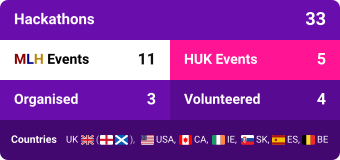

### Hi, I'm Oscar Ryley :)

> 🛠️ **Current Project:** EPSRC-funded summer research on [*Flood Risk Visualisation*](https://github.com/Oscar-Ryley/Flood-Risk-Exposure), part of the SAT-Guard grant.  

  

>**Hackathon Project Highlights:** 
>&nbsp;&nbsp;• [Painting w/ Digital Eyes](https://github.com/f2reninj5/peeping_painting), interactive acrylic portrait, OpenCV & OpenGL. (AstonHack 10) 
>&nbsp;&nbsp;• [Cube Route](https://github.com/FaintLocket424/leedshack2025), Live bus data visualisation in Minecraft. (LeedsHack 2025) 
>&nbsp;&nbsp;• [CHEAiT](https://github.com/samfeast/whack25), AI Agent with FER & voice recognition for a bluffing game. (WHACK 2025) 
>&nbsp;&nbsp;• [ExSpore](https://github.com/Oscar-Ryley/Game-Projects/tree/main/exspore), Mushroom-themed clicker game in the Godot engine. (hackSheffield 9)
