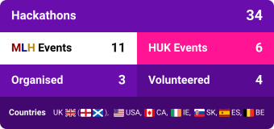

### Hi, I'm Oscar Ryley :)

> **Projects** 
> 💜 **Current:** Organising [DurHack 2026](https://durhack.com/) 
> 🎓 **Ongoing:** MEng Advanced Project on the Frustration Index of Signed Graphs 
> ⚙️ **Previous:** Hacking at Hack the North 2026 with a [*GPTZero x LinkedIn Badge App*](https://github.com/Oscar-Ryley/Hack-the-North-2026) 
> ☀️ **Summer:** EPSRC-funded research on [*Flood Risk Visualisation*](https://github.com/Oscar-Ryley/Flood-Risk-Exposure), part of the £1m SAT-Guard grant.  

  

>**Hackathon Project Highlights:** 
> 👁️ [Painting w/ Digital Eyes](https://github.com/f2reninj5/peeping_painting), interactive acrylic portrait, OpenCV & OpenGL. (AstonHack 10) 
> 🚌 [Cube Route](https://github.com/FaintLocket424/leedshack2025), Live bus data visualisation in Minecraft. (LeedsHack 2025) 
> 🃏 [CHEAiT](https://github.com/samfeast/whack25), AI Agent with FER & voice recognition for a bluffing game. (WHACK 2025) 
> 🍄 [ExSpore](https://github.com/Oscar-Ryley/Game-Projects/tree/main/exspore), Mushroom-themed clicker game in the Godot engine. (hackSheffield 9)
